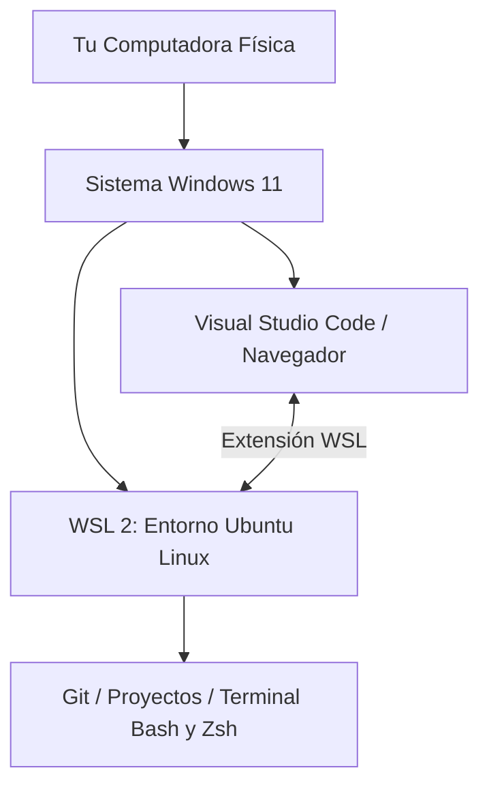
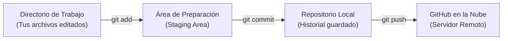
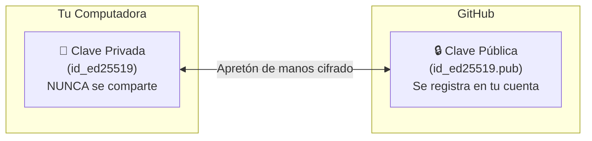
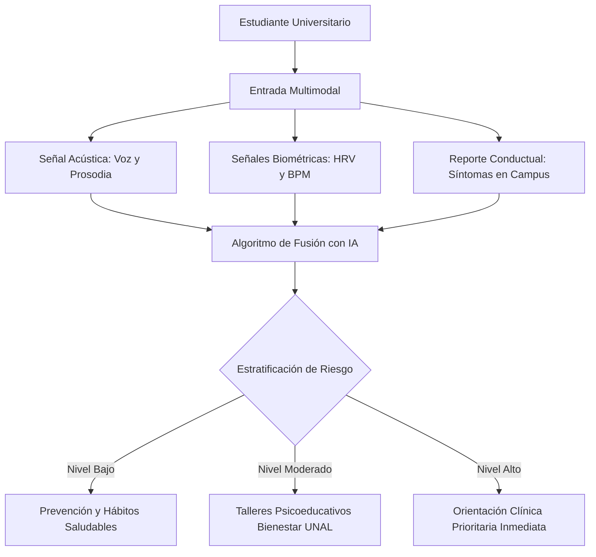

# Manual de Estudio: Git, Linux/WSL, SSH y Desarrollo Web con IA
**Estudiante / Investigadora:** Camila Valencia H.  
**Institución:** Universidad Nacional de Colombia (UNAL)  
**Proyecto:** *Triage Inteligente de Salud Mental en Entornos Universitarios*  
**Fecha:** Septiembre de 2026

---

## 📑 Tabla de Contenidos
1. [El Ecosistema de Trabajo: Windows + WSL (Ubuntu)](#1-el-ecosistema-de-trabajo-windows--wsl-ubuntu)
2. [Fundamentos de Git y Control de Versiones](#2-fundamentos-de-git-y-control-de-versiones)
3. [Seguridad y Conexión SSH (Candado y Llave)](#3-seguridad-y-conexión-ssh-candado-y-llave)
4. [Visual Studio Code + Integración con Linux](#4-visual-studio-code--integración-con-linux)
5. [El Proyecto Web: Psicología, IA y Triage en Salud Mental](#5-el-proyecto-web-psicología-ia-y-triage-en-salud-mental)
6. [Publicación en la Nube con GitHub Pages](#6-publicación-en-la-nube-con-github-pages)
7. [Chuleta de Comandos Rápidos (Cheatsheet)](#7-chuleta-de-comandos-rápidos-cheatsheet)

---

## 1. El Ecosistema de Trabajo: Windows + WSL (Ubuntu)

### ¿Qué es WSL (Windows Subsystem for Linux)?
Es una tecnología de Microsoft que permite ejecutar un sistema operativo **Linux (Ubuntu)** completo y real dentro de tu computadora con Windows 10/11, sin necesidad de instalar máquinas virtuales lentas ni formatear tu disco.



### ¿Por qué los científicos e ingenieros usan Linux?
* **Rendimiento:** Las librerías de Inteligencia Artificial (Python, PyTorch, TensorFlow) se desarrollan primero y con mejor optimización para entornos Linux.
* **Control:** Mayor facilidad para automatizar tareas mediante scripts de terminal.

### Rutas de archivos (Cómo se ven tus carpetas):
* **Desde tu terminal de Ubuntu:**  
  `~/proyectos/Aprendiendo/` (la tilde `~` representa tu carpeta personal `/home/camila/`).
* **Desde el Explorador de archivos de Windows:**  
  `\\wsl.localhost\Ubuntu\home\camila\proyectos\Aprendiendo\`

> [!TIP]
> Si estás en tu terminal de Ubuntu y quieres ver esa misma carpeta en una ventana normal de Windows, solo escribe:
> ```bash
> explorer.exe .
> ```

---

## 2. Fundamentos de Git y Control de Versiones

### ¿Qué es Git y para qué sirve?
Git es un **sistema de control de versiones distribuido**. Imagínalo como una máquina del tiempo o el sistema de guardado de un videojuego:
* Te permite guardar "puntos de restauración" (**commits**) con un mensaje explicativo.
* Si cometes un error o algo se rompe, puedes volver al punto exacto donde todo funcionaba.
* Permite trabajar en equipo sin sobreescribir el trabajo de los demás.

### Diferencia clave: Git vs. GitHub
* **Git:** Es el programa local instalado en tu computadora que vigila los cambios de tus archivos.
* **GitHub:** Es una plataforma en la nube (sitio web) donde subes copias de tus repositorios Git para respaldarlos, compartirlos o publicarlos como páginas web.

### Las Tres Zonas de Git:


1. **Working Directory (Área de trabajo):** Donde creas o modificas tus archivos.
2. **Staging Area (Área de preparación):** Archivos que seleccionaste con `git add` para la siguiente foto.
3. **Repository (Historial de Commits):** Los puntos de guardado definitivos registrados con `git commit`.

### Comandos Esenciales de Git:
* `git init`: Convierte la carpeta actual en un repositorio Git vigilado.
* `git status`: Te dice qué archivos están modificados (en rojo) o listos para guardarse (en verde).
* `git add <archivo>` o `git add .`: Pasa los cambios al área de preparación (el punto `.` agrega todo).
* `git commit -m "mensaje"`: Toma la foto y guarda la versión con una nota descriptiva.
* `git log --oneline`: Muestra la lista histórica de versiones que has guardado.

---

## 3. Seguridad y Conexión SSH (Candado y Llave)

### ¿Qué es una clave SSH (Secure Shell)?
Es un mecanismo de autenticación criptográfica basado en un par de claves:



1. **Clave Pública (el candado):** Se sube a tu cuenta de GitHub. Cualquiera puede verla.
2. **Clave Privada (la llave secreta):** Se queda en tu carpeta `~/.ssh/id_ed25519`. Solo tu máquina la conoce.

### ¿Por qué no usamos contraseñas normales?
GitHub eliminó el soporte para contraseñas de texto al hacer `git push` debido a ataques de phishing e intercepción de contraseñas. Con SSH:
* La autenticación es 100% segura e inmune a que te roben la clave por internet.
* No tienes que escribir contraseñas cada vez que subes cambios.

### Verificación de conexión SSH:
Para comprobar si tu computadora tiene permiso en GitHub:
```bash
ssh -T git@github.com
```
*Respuesta esperada:* `Hi mcvalenciah-prog! You've successfully authenticated.`

---

## 4. Visual Studio Code + Integración con Linux

### ¿Cómo se integran?
Instalamos Visual Studio Code en Windows y la extensión oficial **WSL** (`ms-vscode-remote.remote-wsl`). Esto te da lo mejor de los dos mundos:
* Tienes la interfaz visual cómoda de Windows.
* El código se ejecuta directamente dentro del motor de Ubuntu.

### El comando mágico:
```bash
cd ~/proyectos/Aprendiendo/pagina-web
code .
```
Al ejecutar `code .`, VS Code se abre en Windows con la etiqueta verde en la esquina inferior izquierda: **`WSL: Ubuntu`**.

### Control de Versiones gráfico en VS Code:
* Puedes presionar `Ctrl + Shift + G` en VS Code para ver la pestaña de **Control de código fuente**.
* Allí puedes ver qué líneas cambiaste, escribir el mensaje del commit y pulsar el botón **Confirmar / Commit** con el mouse.

---

## 5. El Proyecto Web: Psicología, IA y Triage en Salud Mental

### Fundamentos Científicos del Proyecto
El proyecto une la **psicología clínica y la inteligencia artificial** para atender una problemática crítica: el bienestar de la comunidad universitaria.



### 1. Biomarcadores Acústicos (La voz):
* **Frecuencia Fundamental (F0):** El tono base de la voz. Alteraciones monótonas suelen correlacionar con estados afectivos planos o depresión.
* **Jitter:** Pequeñas variaciones involuntarias en la frecuencia de ciclo a ciclo causadas por tensión muscular en las cuerdas vocales bajo estrés.
* **Shimmer:** Variabilidad involuntaria en la amplitud (volumen) vocal.
* **Pausas latentes:** Silencios prolongados antes de responder o pausas respiratorias entre oraciones.

### 2. Biomarcadores Fisiológicos (El cuerpo):
* **Variabilidad de la Frecuencia Cardíaca (HRV):** No mide solo cuántas veces late el corazón, sino la variación milimétrica entre latidos sucesivos.
  * *HRV Alta (ej. 70-100 ms):* Indica adaptabilidad, resiliencia y predominio parasimpático (descanso y recuperación).
  * *HRV Baja (ej. 20-40 ms):* Indica sobreactivación simpática constante, agotamiento o estrés agudo sostenido.
* **Frecuencia Cardíaca (BPM):** Elevación en reposo ante hiperalerta emocional.

### Estructura de la Aplicación Web
* **`index.html`:** Esqueleto semántico con navegación, sección Hero con gráfico SVG de cerebro + circuitos, pilares de investigación, simulador interactivo y sección de contacto con tu correo UNAL.
* **`styles.css`:** Diseño en modo oscuro tecnológico (*dark tech*), con paleta de azul eléctrico y morado neón, efectos de cristal translúcido (*glassmorphism*) y diseño totalmente responsivo.
* **`app.js`:** 
  * Animación en canvas HTML5 de redes neuronales y ondas que reaccionan al mouse.
  * Motor de cálculo del simulador de triage con algoritmo ponderado (35% Acústica + 35% Biometría + 30% Síntomas).
  * Sistema interactivo para copiar tu correo `mcvalenciah@unal.edu.co` al portapapeles.

---

## 6. Publicación en la Nube con GitHub Pages

### ¿Qué es GitHub Pages?
Es el servicio de alojamiento gratuito de GitHub que toma tus archivos `HTML`, `CSS` y `JavaScript` y los convierte en un sitio web accesible públicamente en todo el mundo a través de internet.

### Flujo de Actualización en 3 Pasos:
Cada vez que hagas un cambio en tu página web y quieras que se actualice en internet:

```bash
# 1. Entras a la carpeta
cd ~/proyectos/Aprendiendo

# 2. Guardas la versión con Git
git add .
git commit -m "feat: descripción de lo que mejoraste"

# 3. Lo envías a GitHub por SSH
git push
```
En 1 minuto, GitHub actualizará automáticamente tu sitio en:
🌐 **`https://mcvalenciah-prog.github.io/Aprendiendo/`**

---

## 7. Chuleta de Comandos Rápidos (Cheatsheet)

### Navegación en la Terminal:
| Comando | ¿Qué hace? |
| :--- | :--- |
| `pwd` | Muestra en qué carpeta estás ubicado actualmente (*Print Working Directory*). |
| `ls -la` | Lista todos los archivos de la carpeta, incluidos los ocultos como `.git`. |
| `cd nombre-carpeta` | Entra a una carpeta. |
| `cd ..` | Sube un nivel (regresa a la carpeta anterior). |
| `cd ~` | Te lleva directo a tu carpeta principal de usuario (`/home/camila`). |
| `clear` | Limpia la pantalla de la terminal. |

### Flujo de Git:
| Comando | ¿Qué hace? |
| :--- | :--- |
| `git status` | Revisa qué cambios hay pendientes por guardar. |
| `git add .` | Prepara todos los archivos modificados. |
| `git commit -m "mensaje"` | Crea un punto de restauración con una descripción. |
| `git push` | Sube tus commits a GitHub mediante SSH. |
| `git log --oneline -n 5` | Muestra los últimos 5 commits de forma compacta. |

### Acciones con tu Proyecto:
| Acción | Comando |
| :--- | :--- |
| Abrir la web en tu navegador | `cd ~/proyectos/Aprendiendo/pagina-web && explorer.exe index.html` |
| Abrir el proyecto en VS Code | `cd ~/proyectos/Aprendiendo/pagina-web && code .` |
| Servidor local de prueba | `cd ~/proyectos/Aprendiendo/pagina-web && python3 -m http.server 8080` |

---

> [!NOTE]  
> *Documento generado para la sesión de formación e investigación de Camila Valencia H. — Universidad Nacional de Colombia.*
