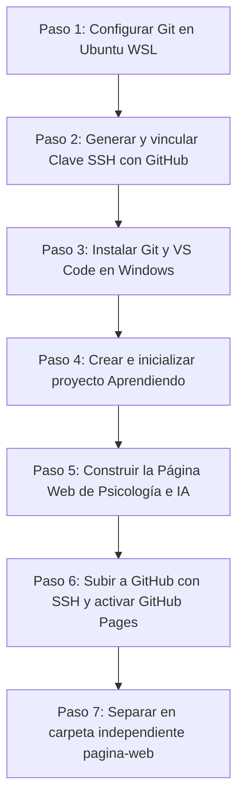

# Bitácora Completa: Resumen de Pasos, Datos Clave y Guía SSH
**Investigadora:** Camila Valencia H.  
**Afiliación:** Universidad Nacional de Colombia (UNAL)  
**Proyecto:** Triage Inteligente de Salud Mental en Entornos Universitarios (IA + Biometría + Acústica)

---

## 📌 1. Ficha Técnica y Datos más Importantes

| Parámetro | Valor / Enlace |
| :--- | :--- |
| **Nombre configurado:** | Camila |
| **Correo institucional:** | `mcvalenciah@unal.edu.co` |
| **Usuario de GitHub:** | `mcvalenciah-prog` |
| **URL de tu web en vivo:** | 👉 [https://mcvalenciah-prog.github.io/Aprendiendo/](https://mcvalenciah-prog.github.io/Aprendiendo/) |
| **Repositorio en GitHub:** | 👉 [https://github.com/mcvalenciah-prog/Aprendiendo](https://github.com/mcvalenciah-prog/Aprendiendo) |
| **Nueva carpeta independiente:** | `~/proyectos/pagina-web/` |
| **Carpeta vinculada a GitHub Pages:** | `~/proyectos/Aprendiendo/` |
| **Ruta en el explorador de Windows:** | `\\wsl.localhost\Ubuntu\home\camila\proyectos\pagina-web\` |

---

## 🔐 2. El Paso de SSH ("sdd"): Explicación Detallada

### ¿Qué es SSH y por qué se usa?
**SSH** *(Secure Shell)* es un protocolo de red cifrado que permite conectar tu computadora directamente con GitHub de manera 100% segura y automática.
* **El problema de las contraseñas:** Antes se usaba usuario y contraseña para subir código, pero GitHub las canceló porque las contraseñas pueden interceptarse o hackearse fácilmente.
* **La solución (Criptografía asimétrica):** SSH utiliza un sistema de **"Candado y Llave Secreta"**.

### ¿Cómo funciona la analogía del candado y la llave?
1. **La Llave Privada (`id_ed25519`):**  
   * Se queda guardada **únicamente** en tu computadora en la ruta `~/.ssh/id_ed25519`.
   * **NUNCA** se comparte, envía ni sube a internet. Es tu firma digital personal.
2. **La Clave Pública / El Candado (`id_ed25519.pub`):**  
   * Es un texto largo que termina en tu correo.
   * Este candado se sube a tu cuenta de **GitHub**.
   * Cuando haces `git push`, GitHub usa el candado para comprobar si tu computadora tiene la llave correcta. Si encajan, te deja pasar al instante **sin pedir ninguna contraseña**.

### ¿Qué comandos se ejecutaron para configurar tu SSH?
1. **Generar el par de claves (algoritmo Ed25519, el más moderno y seguro):**
   ```bash
   ssh-keygen -t ed25519 -C "mcvalenciah@unal.edu.co" -f ~/.ssh/id_ed25519 -N ""
   ```
2. **Ver y copiar la clave pública (el candado):**
   ```bash
   cat ~/.ssh/id_ed25519.pub
   ```
   *Tu clave pública generada fue:*
   ```text
   ssh-ed25519 AAAAC3NzaC1lZDI1NTE5AAAAIA/jWiCINY/DaUmkU8XRnCthqmvi2+NpJFInKNjH2kss mcvalenciah@unal.edu.co
   ```
3. **Pegarla en GitHub:**
   * Entraste a [github.com/settings/ssh/new](https://github.com/settings/ssh/new).
   * En **Title** pusiste: `WSL Ubuntu Camila`.
   * En **Key** pegaste la línea de arriba y guardaste.
4. **Comprobar que la conexión funciona:**
   ```bash
   ssh -T git@github.com
   ```
   *Respuesta exitosa de GitHub:*
   ```text
   Hi mcvalenciah-prog! You've successfully authenticated.
   ```

---

## 📋 3. Resumen Paso a Paso de Todo lo que Hicimos



### Paso 1: Configurar tu identidad en Git (Ubuntu)
Git necesita saber quién firma cada cambio que se guarda:
```bash
git config --global user.name "Camila"
git config --global user.email "mcvalenciah@unal.edu.co"
git config --global init.defaultBranch main
```

### Paso 2: Configuración de la llave SSH
*(Explicado a detalle en la sección 2).*

### Paso 3: Git y Visual Studio Code en Windows
1. Instalamos **Git para Windows** vía terminal como administrador para poder usarlo en herramientas nativas:
   ```powershell
   winget install --id Git.Git -e --source winget
   ```
2. Instalamos **Visual Studio Code** y la extensión **Remote - WSL** (`ms-vscode-remote.remote-wsl`).
3. Configuramos el comando `code` en Ubuntu para poder abrir cualquier carpeta en VS Code con solo escribir:
   ```bash
   code .
   ```

### Paso 4: Inicialización del repositorio
Creamos la carpeta del proyecto y le dimos seguimiento con Git:
```bash
mkdir -p ~/proyectos/Aprendiendo
cd ~/proyectos/Aprendiendo
git init
```

### Paso 5: Creación del Sitio Web de Psicología e IA
Construimos un sitio web moderno con tres archivos:
* **`index.html`:** Estructura con secciones de Hero, Pilares científicos, Simulador interactivo de Triage, Perfil profesional en la UNAL y Contacto.
* **`styles.css`:** Modo oscuro espacial con azul eléctrico y morado neón, efectos de cristal (*glassmorphism*) y diseño adaptable a celulares.
* **`app.js`:** Animación de nodos neuronales y ondas acústicas en canvas, y motor del simulador que calcula el nivel de riesgo combinando acústica (35%), biometría (35%) y síntomas (30%).

### Paso 6: Subida a GitHub y Despliegue en GitHub Pages
1. Se creó el repositorio `Aprendiendo` en GitHub en blanco (con las opciones en **OFF** para no generar conflictos).
2. Se enlazó el repositorio local con la URL SSH de GitHub:
   ```bash
   git remote add origin git@github.com:mcvalenciah-prog/Aprendiendo.git
   ```
3. Se subió el código por primera vez:
   ```bash
   git push -u origin main
   ```
4. Se activó **GitHub Pages** en `Settings > Pages > Branch: main > Save`.

---

## 📂 4. Tu Nueva Carpeta Separada: `~/proyectos/pagina-web/`

Para que tengas el código de la web totalmente independiente y limpio, creamos la carpeta:

```text
/home/camila/proyectos/pagina-web/
├── index.html                  # Estructura de la web
├── styles.css                  # Estilos visuales (azul y morado)
├── app.js                      # Lógica interactiva y simulador
└── RESUMEN_Y_PASO_A_PASO.md    # Este documento de estudio
```

### ¿Cómo usar esta nueva carpeta?

1. **Entrar a la carpeta:**
   ```bash
   cd ~/proyectos/pagina-web
   ```

2. **Abrir la web en tu navegador en Windows:**
   ```bash
   explorer.exe index.html
   ```

3. **Abrir y editar en Visual Studio Code:**
   ```bash
   code .
   ```

4. **Ver tus archivos desde el explorador de Windows:**
   Pega esta dirección en la barra de carpetas de Windows:
   ```text
   \\wsl.localhost\Ubuntu\home\camila\proyectos\pagina-web
   ```

---

## ⚡ 5. Comandos para Recordar en el Día a Día

* **Ver estado de archivos:** `git status`
* **Preparar cambios:** `git add .`
* **Guardar versión:** `git commit -m "descripción de lo que hiciste"`
* **Enviar cambios a GitHub:** `git push`
* **Limpiar terminal:** `clear`
* **Saber dónde estás parado:** `pwd`
